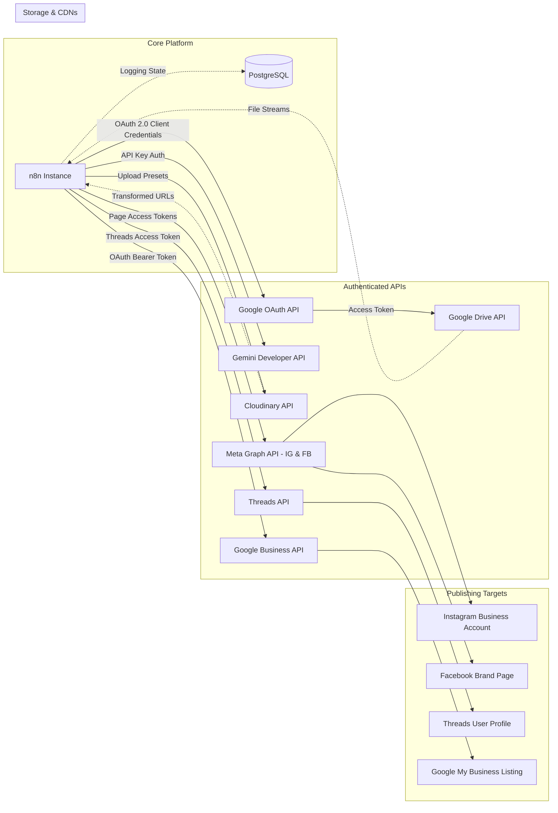

# DEPENDENCY_GRAPH.md - System Dependencies & Data Relationships

This document outlines the external API integrations, services, authentication scopes, and environment-variable dependencies of the **AME Bazaar AI Agent Library**.

---

## 1. Dependency Graph (System-Level)

---

## 2. Infrastructure & Environmental Mapping

The system relies on configuration keys populated in the runtime `.env` file. These variables map to specific nodes in the execution pipeline:

| Scope | Env Variable Key | Dependent Node(s) | Description |
| :--- | :--- | :--- | :--- |
| **System** | `GENERIC_TIMEZONE` | Workflow Settings | Controls cron trigger scheduling. |
| **System** | `WEBHOOK_URL` | Web Service | Public access endpoint configuration. |
| **Storage** | `DATABASE_URL` | Render DB | Connection string to PostgreSQL instance. |
| **Media** | `CLOUDINARY_CLOUD_NAME` | Cloudinary Upload | Identifies Cloudinary cloud space. |
| **Media** | `CLOUDINARY_UPLOAD_PRESET` | Cloudinary Upload | Defines asset storage directory preset rules. |
| **Media** | `CLOUDINARY_LOGO_PUBLIC_ID`| Code Transformations | ID of logo watermark layer. |
| **Cognition**| `GEMINI_API_KEY` | Gemini HTTP Request | Token used to call Gemini 1.5 APIs. |
| **Google Drive**| `GOOGLE_DRIVE_CLIENT_ID` | Google - Refresh Token | OAuth Client Identifier. |
| **Google Drive**| `GOOGLE_DRIVE_CLIENT_SECRET` | Google - Refresh Token | OAuth Client Secret token. |
| **Google Drive**| `GOOGLE_DRIVE_REFRESH_TOKEN` | Google - Refresh Token | Offline refresh token. |
| **Google Drive**| `AME_DRIVE_SOURCE_FOLDER_ID`| Drive - List Images | ID of source folder holding product imagery. |
| **Google Drive**| `AME_DRIVE_DONE_FOLDER_ID` | Drive - Move To Done | ID of destination folder for processed files. |
| **Meta Graph**| `META_ACCESS_TOKEN` | Meta Graph Requests | Token authorizing FB/IG posts. |
| **Meta Graph**| `IG_USER_ID` | Instagram Publishing | Instagram Professional ID. |
| **Meta Graph**| `FB_PAGE_ID` | Facebook Publishing | target Facebook Page ID. |
| **Threads** | `THREADS_ACCESS_TOKEN` | Threads Publishing | Authorization token for Threads API. |
| **Threads** | `THREADS_USER_ID` | Threads Publishing | Destination Threads Profile ID. |
| **Google Business**| `GBP_ACCESS_TOKEN` | GBP - Create Post | Bearer OAuth credentials. |
| **Google Business**| `GBP_ACCOUNT_ID` | GBP - Create Post | Target GMB Account ID. |
| **Google Business**| `GBP_LOCATION_ID` | GBP - Create Post | Target GMB Location ID. |

---

## 3. Data Flow Hierarchy

The relationship diagram below details the data flow between file representations:

1. **Source File (Google Drive):** Raw product picture uploaded manually.
2. **Cloudinary Raw Layer (`ame-bazaar/raw`):** Backup copy of the unprocessed file hosted online.
3. **Cloudinary Transform Layer (Dynamic URL):** Logo branded, resized (`1080x1350`), and optimized poster.
4. **Base64 Payload (n8n runtime):** Transferred to Gemini API for caption generation.
5. **Caption Payload (n8n JSON):** Standardized caption with hashtags used for social media distribution.
6. **Done File (Google Drive):** Moved to the Archive directory to mark complete.
