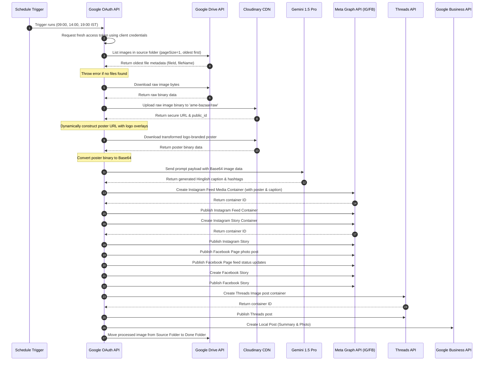

# EXECUTION_FLOW.md - Operational Execution Flow

This document details the precise, step-by-step operational execution flow of the **AME Bazaar Social Media Automation Engine** (`n8n/workflows/social-media-automation.json`).

---

## 1. Step-by-Step Execution Flow

The workflow operates as a linear pipeline running sequentially. Below is the operational sequence:

---

## 2. Key Execution Stages

### Stage 1: Trigger and Authentication
1. **Schedule Trigger - 3x Daily:** Fires at `09:00`, `14:00`, and `19:00` India Standard Time (IST).
2. **Google - Refresh Token:** Obtains a fresh Google OAuth access token using credentials from the environment (`GOOGLE_DRIVE_CLIENT_ID`, `GOOGLE_DRIVE_CLIENT_SECRET`, `GOOGLE_DRIVE_REFRESH_TOKEN`).

### Stage 2: Media Retrieval & Processing
3. **Drive - List Images:** Queries the source folder (`AME_DRIVE_SOURCE_FOLDER_ID`) for images, fetching only the oldest unprocessed file (`orderBy=modifiedTime asc`).
4. **Code - Pick First File:** Extracts metadata. If empty, execution stops and throws a descriptive error.
5. **Drive - Download Image:** Downloads the raw binary file from Google Drive.
6. **Cloudinary - Upload Original:** Uploads the binary raw image to Cloudinary under the folder `ame-bazaar/raw`.
7. **Code - Build Poster URL:** Generates a Cloudinary transformation URL that dynamically:
   - Resizes the image to `1080x1350` pixels (`c_fill,g_auto`).
   - Overlays the branding logo (`CLOUDINARY_LOGO_PUBLIC_ID`) at the bottom right corner.
8. **Cloudinary - Download Poster:** Retrieves the newly branded poster binary.

### Stage 3: Caption Generation
9. **Code - Prepare Gemini Payload:** Encodes the branded image as Base64 and prepares the marketing-focused system prompt.
10. **Gemini - Generate Caption:** Calls Gemini 1.5 Pro API to obtain a premium Hinglish caption with appropriate hashtags.
11. **Code - Extract Caption:** Validates and extracts the caption text.

### Stage 4: Multi-Channel Publishing
12. **Instagram:** Creates and publishes the post in both the **Feed** and **Stories**.
13. **Facebook:** Creates and publishes a Photo Post, Page Feed post, and **Stories**.
14. **Threads:** Creates and publishes an image post container.
15. **Google Business Profile (GBP/GMB):** Publishes a local update to drive offline foot traffic.

### Stage 5: Clean Up
16. **Drive - Move To Done:** Updates parent folders in Google Drive, moving the file to `AME_DRIVE_DONE_FOLDER_ID` to prevent duplicate processing.
