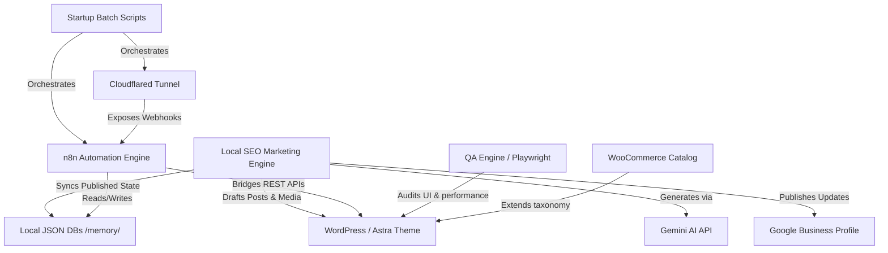
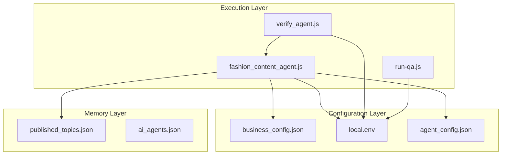
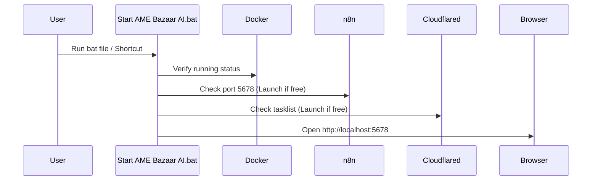
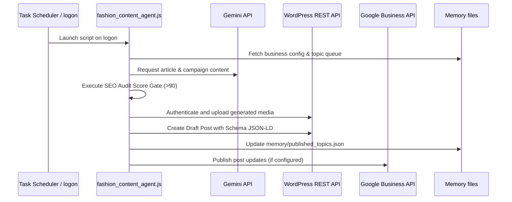

# PROJECT_CONTEXT_PERMANENT.md - Master Project Audit & Context

- **Last Updated:** 2026-08-07
- **Version:** 1.0.0
- **Owner:** Chief AI Operating System Architect (Antigravity)
- **Status:** Approved & Saved (SSOT)

---

## 1. Project Knowledge Graph

The AME Bazaar AI Operating System is structured around modular, decoupled components orchestrating local state, external service connections, and automation pipelines.

---

## 2. System Dependency Graph

This graph lists what each system module depends on to run successfully.

---

## 3. Execution Graph

The platform operates through three main execution paths: **Startup**, **Content Marketing Loop**, and **QA/Verification**.

### 3.1 Startup Workflow

### 3.2 Content Marketing Loop Workflow

---

## 4. Repository Audit & Technical Debt Assessment

During our repository audit, we identified several structural, execution-level, and design optimizations.

### 4.1 Missing Modules
1. **Health Check Script (`scripts/checks/health.js`)**: Folder `scripts/checks/` contains a `.gitkeep` placeholder but no active automated system monitor exists to verify n8n, WordPress, memory databases, or credentials.
2. **WhatsApp API Workflows**: Folders exist under `workflows/whatsapp/` but active configuration templates for the WhatsApp Business API catalog or message triggers are missing.
3. **POS Integration**: No synchronization script exists to link WooCommerce inventories with local offline systems like **Raintech POS**.

### 4.2 Technical Debt
1. **Environment Config Loading**: Copy-pasted env file parsing code (`loadEnv`) exists in three separate files:
   - `scripts/fashion_content_agent.js` (lines 20-44)
   - `scripts/test_gbp_publish.js` (lines 7-18)
   - `scripts/verify_agent.js` (lines 37-48)
2. **Hardcoded Configurations**: Log locations are hardcoded within scripts rather than using environment properties or centralized variables.
3. **Implicit Error Handling**: Network failures in REST calls (e.g. during Gemini or WordPress requests) will crash execution without structured warning triggers or diagnostic reporting.

### 4.3 Duplicate Logic
- **Env Loader**: Redundant implementation of file reading and line-splitting for `.env` loading.
- **Log System**: Hardcoded manual `fs.appendFileSync` calls instead of a shared logger module.

---

## 5. Prioritized Implementation Backlog (Business ROI Focused)

This backlog outlines high-value engineering additions prioritized by business value, ease of execution, and immediate impact.

| Rank | Task Description | Impact Area | ROI Category | Status |
| :--- | :--- | :--- | :--- | :--- |
| **1** | **Centralize Shared Utilities** Refactor duplicated `loadEnv` and log systems into `scripts/utils/`. | Code Integrity & Maintainability | Low Cost / Technical Cleanliness | **Planned (P0)** |
| **2** | **Deploy Health Check Module (`scripts/checks/health.js`)** Add health checker to startup and verification scripts to confirm WordPress, n8n, and credentials validity. | System Reliability | High (Pre-empts crashes, ensures OS status) | **Planned (P0)** |
| **3** | **Local SEO Rank Monitoring Tool** Write a script checking AME Bazaar's search presence in local search results and AI engine references. | SEO & Store Foot Traffic | High (Tracks Stage 1 business conversions) | **Planned (P1)** |
| **4** | **WhatsApp Integration & Catalog Pipeline** Create n8n configurations and catalog updates to let clients browse and order via WhatsApp. | Store Conversions | High (Implements Stage 2 business model) | **Planned (P1)** |
| **5** | **Raintech POS & WooCommerce Inventory Sync** Ensure real-time matching between offline store sales and online commerce pages. | Inventory Integrity | Critical (Stops stock overselling in Stage 3) | **Planned (P2)** |

---

## 6. How Future Development Continues

All future development must be conducted on isolated feature branches, pass the verification scripts (`node scripts/verify_agent.js`), execute the local QA checks (`node scripts/run-qa.js`), and maintain this permanent context as the Single Source of Truth.
