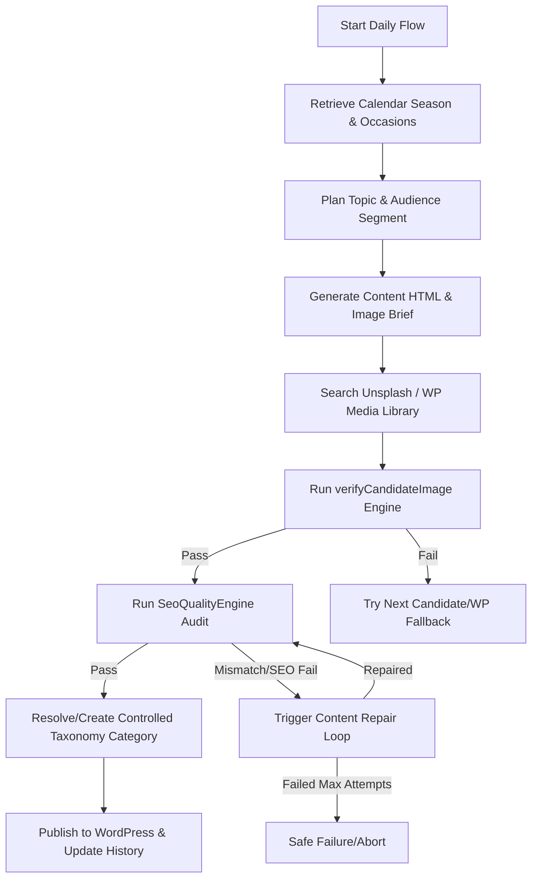

# AI Website Fashion Blog Agent

## Agent Purpose
The **AI Website Fashion Blog Agent** is responsible for AME Bazaar's autonomous website fashion and blog content system. It plans, creates, validates, and publishes SEO-optimized, highly relevant fashion articles that highlight AME Bazaar's products, custom tailoring services, and community presence in Kirari, Delhi. It ensures that all content is seasonally appropriate, visually consistent, and mapped to controlled business segments.

---

## Business-Level Description
In simple terms, this agent acts as an autonomous digital marketer, fashion writer, and publisher for AME Bazaar. Instead of relying on manual content writing or using generic, repetitive templates, this agent:
1.  **Observes the Calendar and History:** It checks the current season in Delhi and identifies approaching Indian festivals or wedding seasons.
2.  **Plans Balanced Topics:** It generates article ideas that rotate systematically through AME Bazaar's ten core business offerings (Ladies Wear, Gents Wear, Kids Wear, etc.) without repeats.
3.  **Generates High-Quality Articles:** It writes articles exceeding 600 words, including styled HTML content, Yoast SEO tags, local citations (Kirari, Mubarakpur Road), and relevant store CTAs.
4.  **Finds and Verifies the Perfect Image:** It searches for real images (via Unsplash or WordPress Media Library) and runs them through a rigorous verification check (demographics, age, and style) to ensure a Men's article never receives a Women's outfit photo.
5.  **Performs Quality Assurance:** It audits every article against Yoast, AEO, and GEO standards, automatically correcting failures via a repair loop before publishing.
6.  **Publishes to WordPress:** It matches the article to AME Bazaar's controlled categories (creating them if missing) and posts the article to WordPress.

---

## Agent Responsibilities
-   Daily generation of seasonally adaptive and festival-aware fashion article topics.
-   Rotation and balanced coverage of all client demographics (Ladies, Gents, Boys, Girls, Kids, and Family).
-   Strict semantic verification of featured images.
-   Controlled taxonomy category assignment, avoiding `Uncategorized` publishing.
-   Enforcement of SEO/AEO/GEO rules and schema generation.
-   Autonomous content repair and publishing to WordPress.

---

## Current Architecture & Code Mapping
The agent's codebase is written in Google Apps Script and executed inside AME Bazaar's Google Sheets environment:

| Module / Responsibility | Apps Script Source File | Core Functions / Variables |
| :--- | :--- | :--- |
| **Topic Planning** | [`TopicEngine.gs`](file:///C:/Users/user/.gemini/antigravity/scratch/ame-bazaar-ai-os/gas_agent/TopicEngine.gs) | `selectNextTopic()` |
| **Prompts & Context** | [`Prompts.gs`](file:///C:/Users/user/.gemini/antigravity/scratch/ame-bazaar-ai-os/gas_agent/Prompts.gs) | `TOPIC_GENERATOR_PROMPT_TEMPLATE`, `CONTENT_AGENT_SYSTEM_PROMPT_TEMPLATE`, `buildTopicPrompt()`, `buildContentPrompt()` |
| **Season & Occasion Logic** | [`BusinessKnowledge.gs`](file:///C:/Users/user/.gemini/antigravity/scratch/ame-bazaar-ai-os/gas_agent/BusinessKnowledge.gs) | `getCurrentSeason()`, `getApproachingOccasions()` |
| **Content Generation & Orchestration** | [`Main.gs`](file:///C:/Users/user/.gemini/antigravity/scratch/ame-bazaar-ai-os/gas_agent/Main.gs) | `generateDailyArticle()`, `MainExecutionFlow()` |
| **Image Search & Verification** | [`ImageEngine.gs`](file:///C:/Users/user/.gemini/antigravity/scratch/ame-bazaar-ai-os/gas_agent/ImageEngine.gs) | `fetchTopicSpecificImage()`, `verifyCandidateImage()`, `evaluateCandidateSemantics()` |
| **SEO & Quality Gate Audit** | [`SeoQualityEngine.gs`](file:///C:/Users/user/.gemini/antigravity/scratch/ame-bazaar-ai-os/gas_agent/SeoQualityEngine.gs) | `runSeoAudit()`, `checkImageSemanticMismatch()` |
| **WordPress Publishing** | [`WordPressPublisher.gs`](file:///C:/Users/user/.gemini/antigravity/scratch/ame-bazaar-ai-os/gas_agent/WordPressPublisher.gs) | `publishToWordPress()`, `getOrCreateWordPressCategory()`, `mapToControlledTaxonomy()` |
| **Settings & Secrets** | [`Config.gs`](file:///C:/Users/user/.gemini/antigravity/scratch/ame-bazaar-ai-os/gas_agent/Config.gs) | `getSecret()`, `getTopicMemory()`, `saveTopicMemory()` |
| **Agent Unit Tests** | [`scripts/test_topic_system.js`](file:///C:/Users/user/.gemini/antigravity/scratch/ame-bazaar-ai-os/scripts/test_topic_system.js) | Test suite scenarios A through J |

---

## Input
-   **System Date/Time:** Governs Delhi seasons and upcoming Indian fashion occasions.
-   **Script Properties:** Secret credentials and parameters.
-   **Dynamic History (`AME_PUBLISHED_TOPICS_MEMORY`):** The last 10 published articles are used to prevent repetitive topics/keywords/segments.

---

## Processing Pipeline


---

## Output
-   **Live WordPress Post:** Containing H1/H2 structured content, Yoast metadata, citation schema, resolved category, and verified featured image.
-   **GBP Broadcast Payload (Optional):** Structured CTA summaries for Google Business Profile.

---

## Connected Services
-   **Gemini API:** Performs content writing, SEO audits, and visual analysis (Gemini Vision).
-   **Unsplash REST API:** Primary library source for featured images.
-   **WordPress REST API:** Publishes posts, uploads media, and manages category mapping.

---

## Important Rules

### Image Verification Rules (Zero-Bypass Safety)
-   All image candidates (from Unsplash and WordPress Media Library) must go through the same unified `verifyCandidateImage()` contract.
-   **TEST J Regression Gate:** The final SEO Quality Gate double-checks the image. The ground truth description of the image is evaluated. Spoofed/overwritten Alt text or filenames (e.g. Alt text changed to "mens casual" on a woman's photo) **MUST** still result in rejection if the visual description indicates wrong demographics.
-   **Multi-Audience Target Rules:** Under-represented demographics (e.g., family outfits) are evaluated independently to prevent false contradictions (e.g. family outfit contains a man, a woman, and kids).

### Category Taxonomy Rules
-   Every article must resolve to AME Bazaar's 16-tier Controlled Taxonomy:
    -   `Ladies Wear`, `Gents Wear`, `Boys Wear`, `Girls Wear`, `Kids Wear`, `Family Fashion`, `Ethnic Wear`, `Western Wear`, `Winter Wear`, `Summer Wear`, `Wedding & Occasion Wear`, `Fashion Trends`, `Styling Tips`, `Tailoring & Alterations`, `Garment Care`, `Local Fashion / Kirari`.
-   **No Uncategorized Posts:** Staging or publishing under ID 1 ("Uncategorized") is prohibited. If category mapping fails, the agent attempts safe creation; if still unresolved, it halts and fails safely.

### Season & Occasion Logic
-   Seasons (Winter/Summer/Monsoon) are mapped from the current system calendar.
-   Upcoming Indian fashion occasions (Diwali, weddings, school reopening) automatically influence topic planning and flow down to image briefs.

### Quality Gate & Repair Loop
-   Articles must score at least **90/100** on the SEO Audit.
-   If audit fails or if `imageSemanticMismatch == true`, a repair prompt is automatically compiled, and the article is sent to a 2-attempt repair loop.
-   An invalid image or a category failure **must never** be bypassed; the post will fail safely instead of publishing low-quality content.

---

## Testing & Deployment
-   **Testing:** Run the test runner via Node:
    ```bash
    node scripts/test_topic_system.js
    ```
-   **Deployment:** Google Apps Script codebase resides in `/gas_agent/`. Run clasp push to deploy updates to the active Google Apps Script project:
    ```bash
    clasp push
    ```

---

## Required Environment Variables & Secrets
These should be defined in Google Apps Script Script Properties or local development `.env` (Never commit actual values):
-   `GEMINI_API_KEY`: Gemini API access key.
-   `UNSPLASH_ACCESS_KEY` / `UNSPLASH_SECRET_KEY`: Unsplash developer credentials.
-   `WORDPRESS_URL`: Target WordPress instance domain.
-   `WORDPRESS_USERNAME`: Authorized editor username.
-   `WORDPRESS_APPLICATION_PASSWORD`: WP application password.

---

## Current Status & Next Steps
-   **Status:** Active. Fully integrated with seasonal topic planning, controlled taxonomy categories, and unified image semantic checks.
-   **Known Limitations:** Vision API calls are capped by Gemini 429 quota limits; the agent relies heavily on deterministic alt/desc visual metadata fallback verification during high-traffic periods.
-   **Next Development Area:** Add automated Google Business Profile (GBP) broadcast publisher sync.
